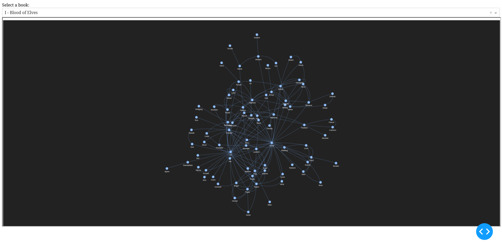

# Character Relationship Mapping

The purpose of this project is both to test the capability of natural language processing in the process of character identification from a book series and to understand how this could be implemented to understand the principles of analyzing networks through visualization. The project consists of a webscraper, a python script to create the character maps and a second script to create a dashboard so as to visualize the character maps.

## Webscraper (scraper.ipynb)

This notebook functions to scrape the character webpage of the Witcher fandom website. The scraping of is done through the selenium library and runs windowless with the FireFox drivers provided by the Gecko Driver Manager. 

The names of the characters are stored in a pandas dataframe, matched to the books in which they appear. The names are then filtered to find only the first name of the characters and this is stored in a new column to allow more accurate identification. The column containing the books names is also cleaned to ensure that only the name of the book is kept as the webpage formatting does add unnecessary text.

## Relationship map creation
There are 2 files in this repository related to the relationship map creation, a notebook and a python script. The notebook (relationship_creation.ipynb) contains the exact same process as the script, however it was used to test the principle of the program on only 1 of the books that were used in the final iteration and serves as a method to test the thought process and inspect the output of the code in chunks.

The full process of the code is:
- Load spacy module and all the books stored in a data folder
- Convert the books into text that can be parsed by the spacy module and using the module to create a dataframe of the entities found in the text
- Filter and clean the dataframe to contain only characters from the lists generated by the webscraper and specifically their first name
- From here we use a window over the sentences to determine that if the 2 characters appear together in this window they have some form of relationship with one another
- Using the window size decided upon the characters are then connected in a new dataframe to specify a relationship
- This relationship dataframe is sorted and a weight column generated to specify the number of instances in which a relationship between them was detected
- This relationship dataframe is saved as a CSV file to form the basis of the character relationship map

In the notebook, relationship_creation.ipynb, the dataframe was visualized using the networkx graphing library to ensure that the format of the dataframe was suitable to generate network graphs.

## Dashboard

This project is furthered after the creation of the character map into displaying the maps for each book in a dashboard, as below.

This dashboard has a dropdown function to select a book from the dataset and update to display the relavent map. The dashboard was created using the Dash library as there is not much customization needed for the current settings.

The map is created by passing the relevant CSV file to a Networkx network and then loading that graph into a pyvis Network.

Currently the dashboard is set up only to display the graphs but the code is in the process of being altered to add more context into each network, such as using weighting to determine the significance of the relationship or using colors to highlight the direct lines of connection for the main characters.
